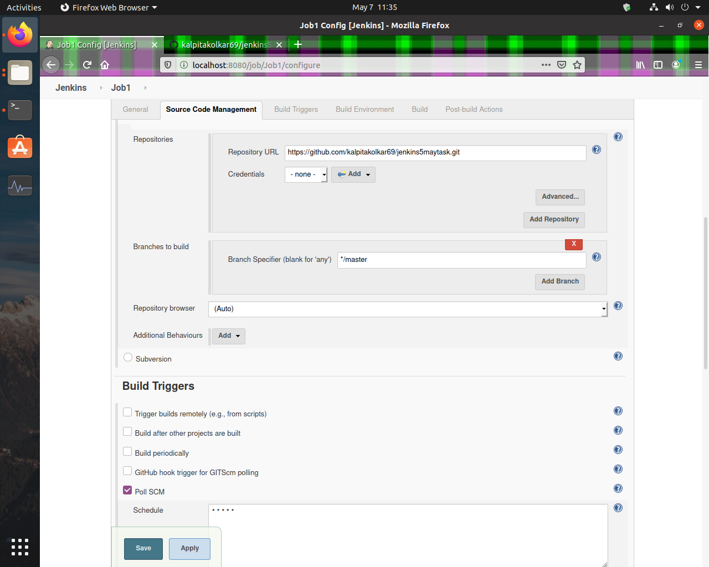
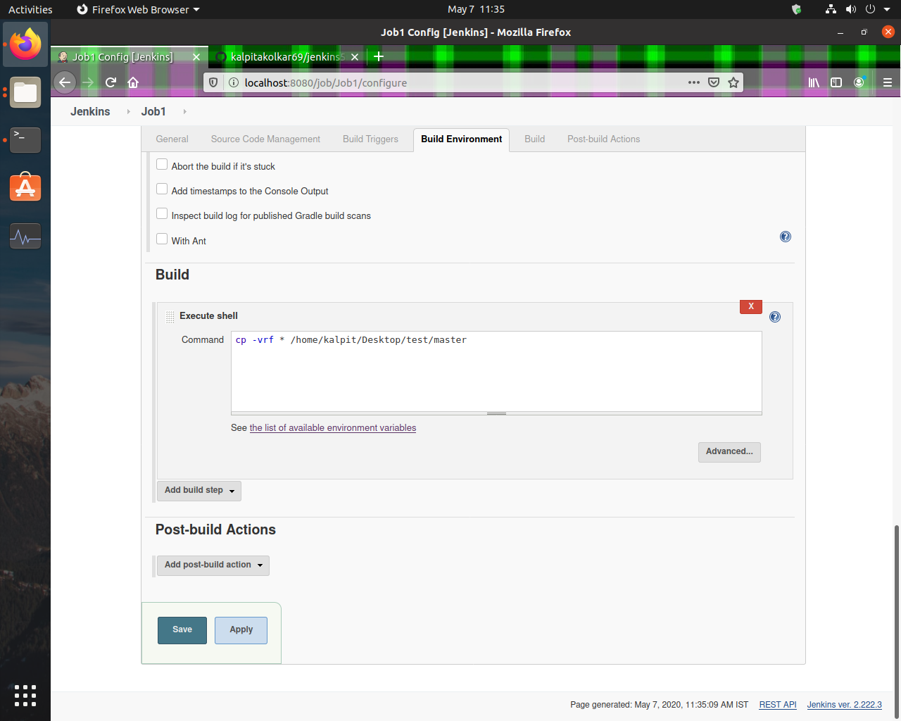
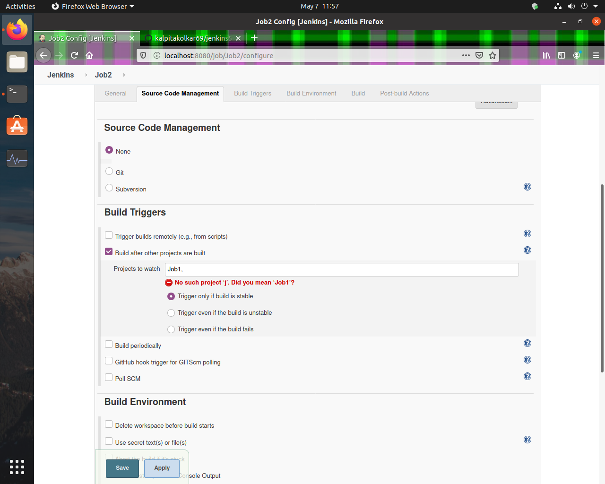
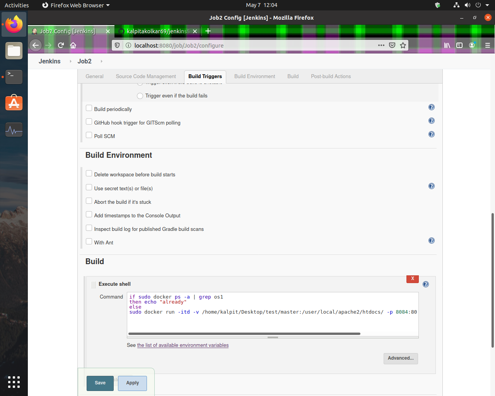
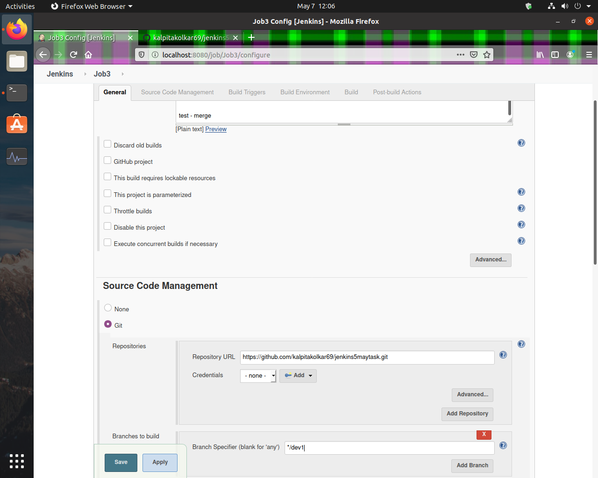
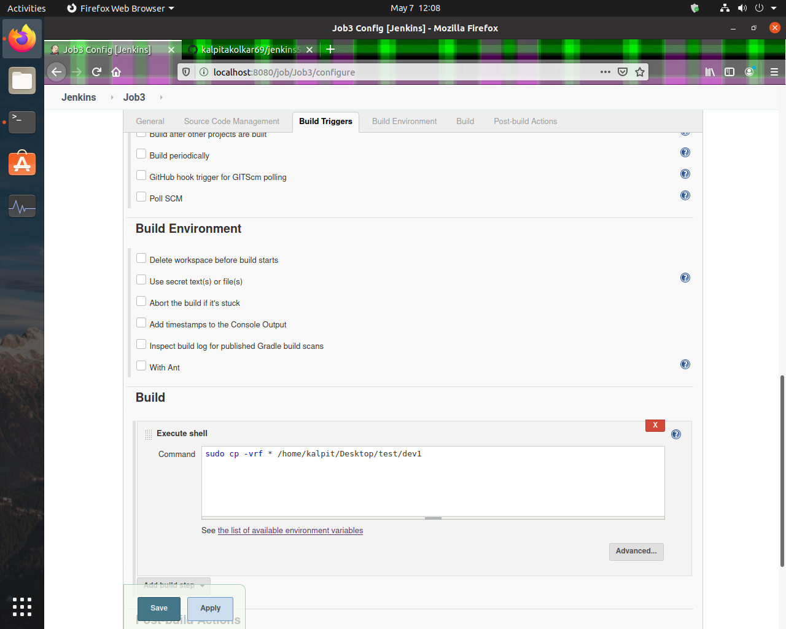
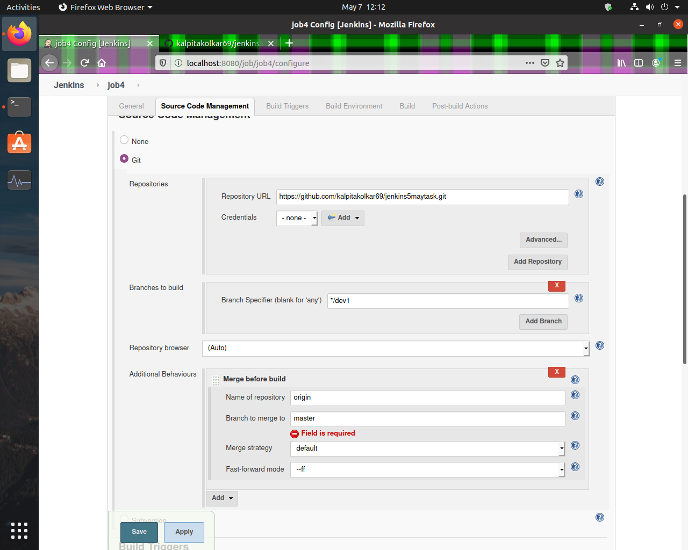

# About Project

This project is for Automation of  merging Github branches with Jenkins

### Step 1: We created a job which triggers when anything is pushed on github.

### Step 2: It Downloads all the files inside that repository from master branch and copies it to system folder.

### Step 3: Now the second job triggers when the first job completes.

### Step 4: When second job is triggered it will run docker container if not already running.

### Step 5: Third job will download files from dev1 branch of same repository.

### Step 6: Downloaded files will now be copied inside system folder which then will be supplied for testing.

### Step 7: The manual testing will be done and then the final job will run which will merge dev1 branch with master branch.

### Step 8: Due to merging of dev1 branch with master branch again job 2 will trigger which will update the code from dev1.
